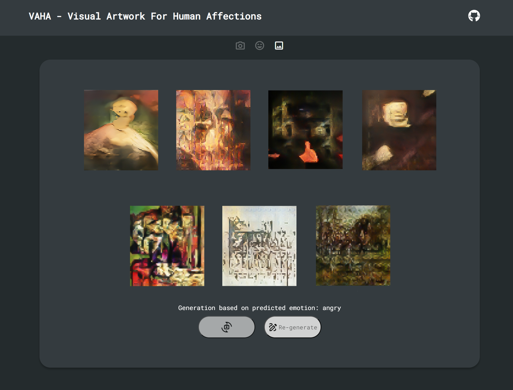

# Midterm - Final update

# [VAHA - Visual Artwork For Human Affections](https://github.com/zxxwxyyy/VAHA/) Demo Page




## Features

- **Centralized State Management with useContext:** Enables efficient state management for the webcam capture component.
- **Emotion-Based Image Generation (Faking):** Generates images based on a randomly selected emotion label.
- **User-Controlled Image Generation:** Allows users to regenerate images with a "Re-generate" button.
- **Webcam Image Capture:** Utilizes the react-webcam library to capture images.
- **Progress Bar:** Visually represents the emotion detection process.
- **Retake Option:** Users can choose to retake the photo if unsatisfied with the capture.
- **Minimalist UI Design:** A clean and user-friendly design enhances user experience.
- **Interactive UI Elements:** Hover effects on icon buttons and a real-time tracking stepper.

## Implementation Details

- **cameraContext.js**
    - Utilizes useContext to centralize state and functionality, streamlining data flow and state access across components.

- GenerateImage.js
    - Implements handleGeneration to manage the generate and re-generate button actions.
    - Utilizes startGeneration to control the progress bar's behavior.

- WebcamCapture.js
    - Employs the react-webcam library for image capturing.
    - Uses useState to manage captured image states.
    - Implements useRef to reference certain values without triggering re-renders.
    - Simulates emotion predictions by randomly selecting emotion labels with Math.random().

- Stepper.js
    - Maintains the current step's state, adjusting the UI accordingly.
    - Dynamically updates icon styles based on the current step.

## Development 

To run this repo:
1. Clone the repo
2. ```bash
    cd your_saved_dir
3. Start the server
4. ```bash
    npm start