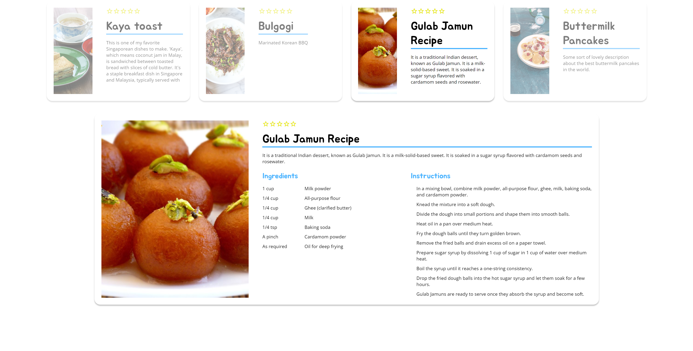
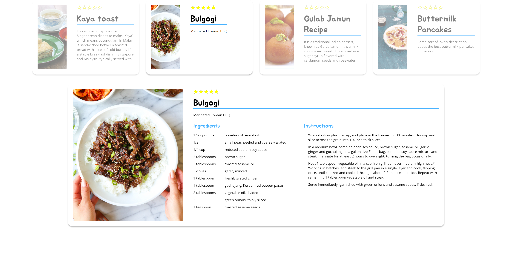

# Week 3 assignment - Recipe Card 

This project showcases a collection of recipe cards. Users can view a list of recipes, expand each card to see more details, and rate them using a star-based rating.

## Features
- Responsive Recipe Cards: Each card adjusts its content based on the viewport size.
- Expandable Details: Clicking on a card expands it to show detailed ingredients and instructions.
- Star Rating: Users can rate recipes by hovering over and clicking on stars. The system supports half-star ratings.
- Dynamic Styling: The design includes hover effects, dynamic expansion, and more.

See below screenshot as reference. 

