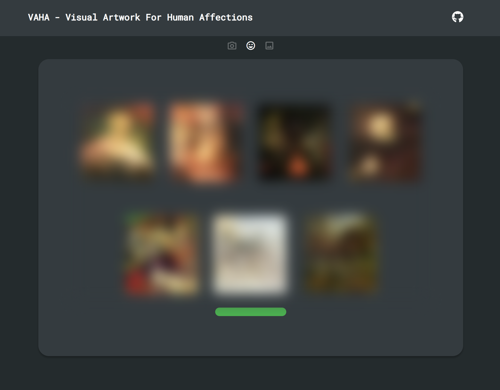

# Midterm - 1st update

# [VAHA - Visual Artwork For Human Affections](https://github.com/zxxwxyyy/VAHA/) Demo Page




## Features

- **Generate images base on the predicted emotion label(faking)**
- **Re-generate button in the end to allow user regenerate the images**
- Capture images via react-webcam library.
- Faking and place holding for emotion prediction later by using random selection from a set of predefined emotions.
- A Progress bar to show the process of emotion detection.
- Offers option to retake the photo.
- UI ONLY for minimalist design and better user experience.
- Hover effect for all icon buttons
- Real-time tracking stepper

## Implementation Details

- **GenerateImage.js**
    - Using `handleGeneration` to handle generate and re-generate buttons
    - Using `startGeneration` to control the progress bar

- WebcamCapture.js
    - Using `react-webcam` library
    - Using `useState` to store captured images
    - Using `useRef` as reference to avoid re-render
    - Using `math.random` for randomly select emotion label as faking of prediction

- Stepper.js
    - Holds the current state of the current step
    - Change icon styles by getting the current step

## Development 

To run this repo:
1. Clone the repo
2. ```bash
    cd your_saved_dir
3. Start the server
4. ```bash
    npm start